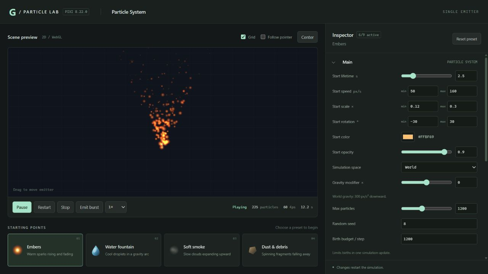
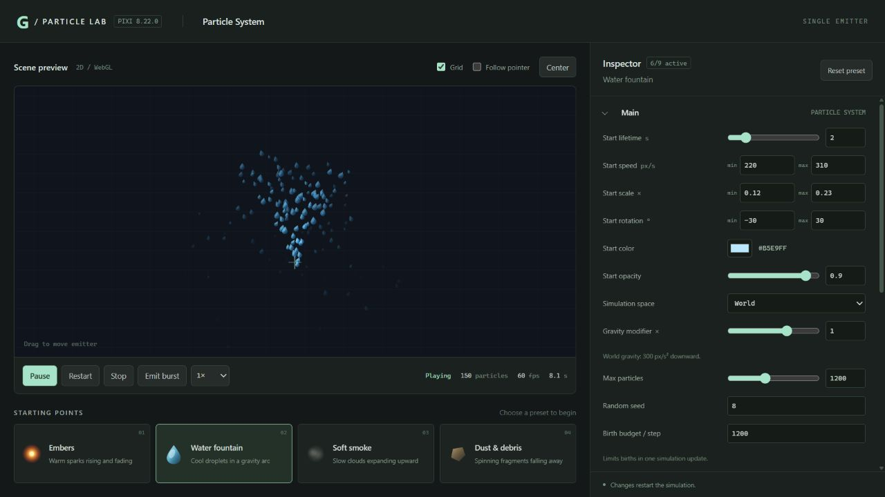
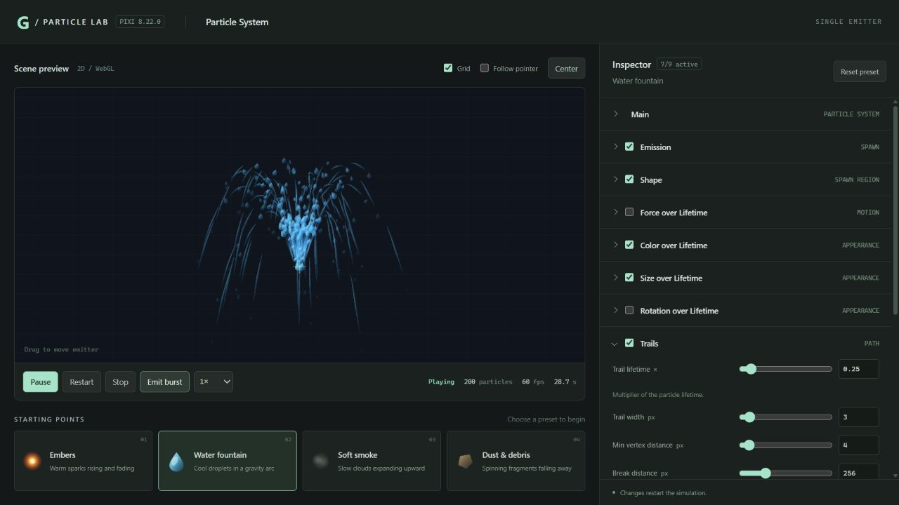

# pixi8-particle-system

Modular particle effect logic compatible with PixiJS 8 `ParticleContainer`, with gravity, manual emit/bursts, projectile effects, trails, and a static Particle Lab demo.

PixiJS 8's `ParticleContainer` provides efficient particle rendering. This project adds emission, motion, appearance changes, lifetime management, playback controls, and resource cleanup. The host supplies textures and time steps; the system computes particle state, and the Pixi adapter synchronizes it with the rendering component.

## Features

- Constant-rate emission and manual bursts; point, circle, and rectangle spawn shapes.
- Initial speed, scale, rotation, tint, and alpha, with seeded random parameters.
- Motion, constant acceleration, and host-supplied gravity.
- Color, alpha, and size over lifetime, plus continuous rotation.
- Single textures, sequence animation, random frames, and grid texture slicing.
- Layered JSON effects with strict parsing and validation.
- Trails and local/world simulation spaces.
- Projectile effect recipes: flying light particles, smoke paths, and glowing heads with trails.
- Play, pause, resume, stop and drain, reset, and destroy.
- Bounded particle pooling and extensible behaviors, lifecycle observers, and renderers.

## Repository layout

```text
geminum-particles/
  runtime/core/         Particle state, lifecycle, clock, and module contracts
  runtime/modules/      Emission, spawning, motion, appearance, and trails
  runtime/composition/  Compile effect configuration into runtime modules
  runtime/entity/       JSON parsing, validation, and frame selection
  runtime/pixi/         Pixi renderers and effect factories
  entries/              Public core, config, and pixi entry points
  dist/                 Existing JavaScript and TypeScript declarations
  scripts/build.mjs     Build and type checking
example/                Interactive Vite demo
.agents/skills/skill-pixi-geminant-particles/
                        Integration guides, JSON Schema, recipes, and validation
```

The repository is named `pixi8-particle-system`, the source directory is `geminum-particles`, and the package name is `geminant-particles`. The current package is version `0.1.0` and marked `private: true`; this repository does not claim that it is published on npm.

## Local integration

The peer dependency is `pixi.js ^8.21.0`; the development dependency is `typescript ^5.9.3`.

```sh
cd geminum-particles
npm install
npm run typecheck
npm run build
```

Alternatively, set `GEMINANT_PARTICLES_BUILD_DEPS` to an existing dependency directory containing both `typescript` and `pixi.js`.

Install the local package in a host project using PixiJS 8:

```sh
npm install /absolute/path/to/pixi8-particle-system/geminum-particles
```

Public entry points are `geminant-particles` (equivalent to `/core`), `geminant-particles/core`, `geminant-particles/config`, and `geminant-particles/pixi`. Pure logic supports custom renderers; the Pixi entry connects the simulation to `ParticleContainer`.

## Quick example

The host creates a Pixi `app` and loads a valid `texture`. Load the particle extension before `app.init()` or the first renderer initialization. Trails also require `pixi.js/mesh` registration before initialization.

```ts
import 'pixi.js/particle-container';
import 'pixi.js/mesh';
import { createPixiParticleEffect } from 'geminant-particles/pixi';

// Run these imports before app.init(); app and texture belong to the host.
const { system, container } = createPixiParticleEffect({
  texture,
  blendMode: 'add',
  main: {
    maxParticles: 256,
    startLifetime: 1,
    startSpeed: { min: 40, max: 100 },
    startScale: { min: 0.2, max: 0.5 },
    startTint: 0xffaa44,
    randomSeed: 42,
  },
  emission: { rateOverTime: 60 },
  shape: { shapeType: 'point', spreadRadians: Math.PI * 2 },
  colorOverLifetime: { endTint: 0xff3300, endAlphaFactor: 0 },
  sizeOverLifetime: { endScaleFactor: 0 },
});

app.stage.addChild(container);
system.setOrigin(400, 300);
system.play();
const tick = (ticker: { deltaMS: number }) => {
  system.update(ticker.deltaMS / 1000);
};
app.ticker.add(tick);

// Stop new emission; keep ticking until particles and trails drain.
// system.stop();

// When releasing the scene:
// app.ticker.remove(tick);
// system.destroy();
```

Times use seconds, and angles use radians. Factories do not automatically play or create a ticker. Use `emit(count)` for a burst without calling `play()` first.

## Controls and runtime contract

| Operation | Behavior |
| --- | --- |
| `play()` | Start from stopped; automatic emission requires emission configuration |
| `emit(count)` | Generate the specified number of particles immediately |
| `pause()` / `resume()` | Freeze or resume simulation |
| `stop()` | Stop emission and let existing particles and trails drain |
| `reset()` | Clear the effect and reset time/modules while retaining the reusable pool |
| `setOrigin(x, y)` | Set the birth origin for future particles |
| `update(dtSeconds)` | Advance by a finite, nonnegative time step in seconds |
| `destroy()` | Release resources owned by the system |

States are `stopped`, `playing`, `draining`, `paused`, `faulted`, and `destroyed`. The core exposes `particleCount`, `hasPendingWork`, `error`, and `diagnostic`. Trails can outlive particles; use state or `hasPendingWork` to determine whether the effect has drained.

The host owns supplied textures, TextureSources, and parent containers. Destroying the system does not destroy those shared resources. Keep textures alive and their frame layouts stable during playback. World simulation, gravity, and world-space trails require host environment bindings. Exceeding capacity or the per-update birth budget throws rather than silently discarding particles. Runtime module failures enter faulted; inspect diagnostics and destroy the system afterward.

## Layers, frame animation, and trails

Use `createPixiParticleEffect` for a single texture, `createPixiFrameParticleEffect` for multiple frames, and the asynchronous `createPixiParticleEntity({ config, resolveTexture })` factory for layered JSON effects. The host resolves logical asset references to valid textures, attaches the container, starts playback, and updates each frame. Multiple frame textures must share one TextureSource.

- [Runtime integration](.agents/skills/skill-pixi-geminant-particles/references/runtime-integration.md)
- [Runtime API](.agents/skills/skill-pixi-geminant-particles/references/runtime-api.md)
- [JSON effect contract](.agents/skills/skill-pixi-geminant-particles/references/effect-contract.md)
- [JSON Schema](.agents/skills/skill-pixi-geminant-particles/references/effect.schema.json)
- [Space and gravity](.agents/skills/skill-pixi-geminant-particles/references/space-gravity.md)
- [Trails](.agents/skills/skill-pixi-geminant-particles/references/trails.md)
- [Configuration examples](.agents/skills/skill-pixi-geminant-particles/assets/)

## Static Particle Lab demo

The [Particle Lab](example/README.md) is a static Vite website with a live WebGL preview and a modular Inspector. It supports gravity, manual **Emit burst**, trails, local/world simulation, draggable emitters, pause/resume, restart, stop-and-drain, and simulation speed controls. Optional modules can be enabled independently, and parameter changes rebuild the effect.

Four starting presets are included: **Embers**, **Water fountain**, **Soft smoke**, and **Dust & debris**. The renderer offers 11 supplied textures. The current editor targets a single emitter and single-frame textures; the runtime also supports layered effects and frame animation.

From `example`, run:

```sh
npm install
npm run dev
node --test src/editor-model.test.js
npm run build
npm run preview
```

The production build is written to `example/dist/` and uses relative asset paths for static hosting. The demo uses the existing local package build in `geminum-particles/dist`. This repository includes the website source; the [demo directory](https://github.com/joeylu/pixi8-particle-system/tree/main/example) is not a hosted live demo.

### Screenshots

Particle Lab overview with the modular Inspector:



Water fountain with host gravity and a gravity modifier:



Manual emit/burst with trails enabled:



## Projectile effects

Projectile effects are composed from the same emission, motion, lifetime, simulation-space, and trail modules. Projectile is an effect use case rather than a separate runtime module. The bundled recipes cover a flying light projectile, a moving emitter leaving smoke, and a glowing head with smoke and trails:

- [Flying light projectile](.agents/skills/skill-pixi-geminant-particles/assets/projectile-trail.effect.json)
- [Projectile smoke path](.agents/skills/skill-pixi-geminant-particles/assets/projectile-smoke.effect.json)
- [Smoke, glowing head, and trail](.agents/skills/skill-pixi-geminant-particles/assets/projectile-smoke-glow.effect.json)
- [Recipe integration notes](.agents/skills/skill-pixi-geminant-particles/references/recipes.md)

The host supplies launch position, direction, trigger timing, textures, and any external emitter route. These JSON recipes are runtime examples; they are not additional presets in the current Particle Lab interface.
