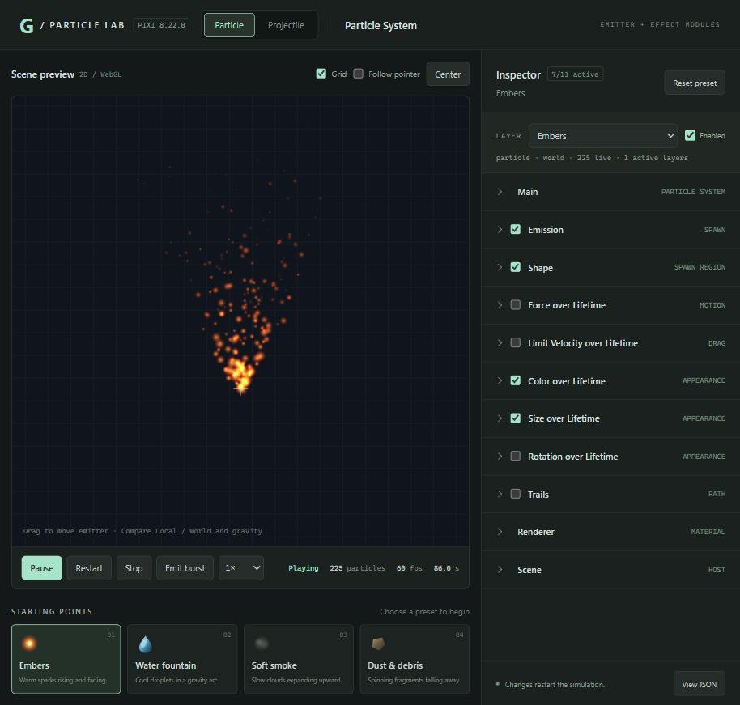
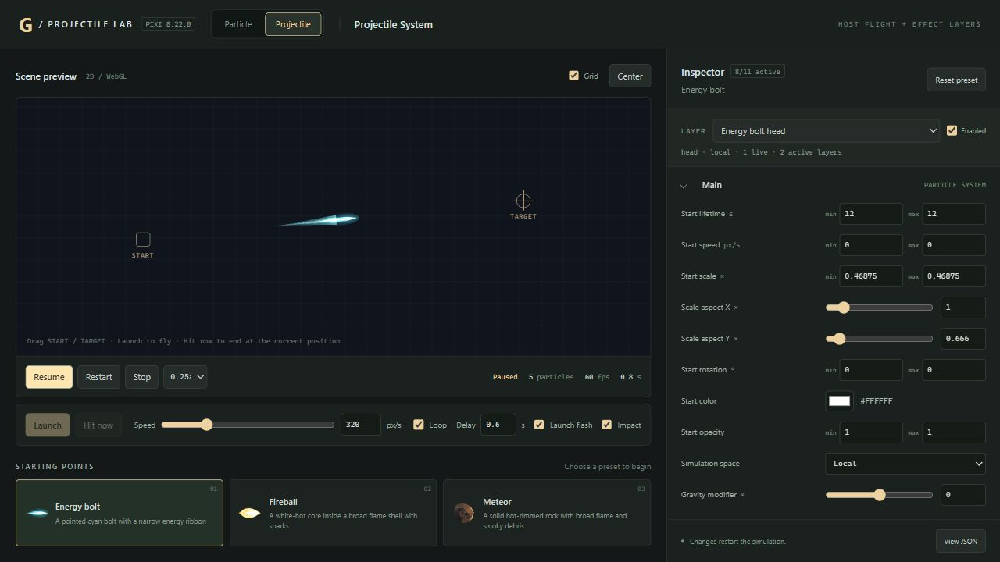
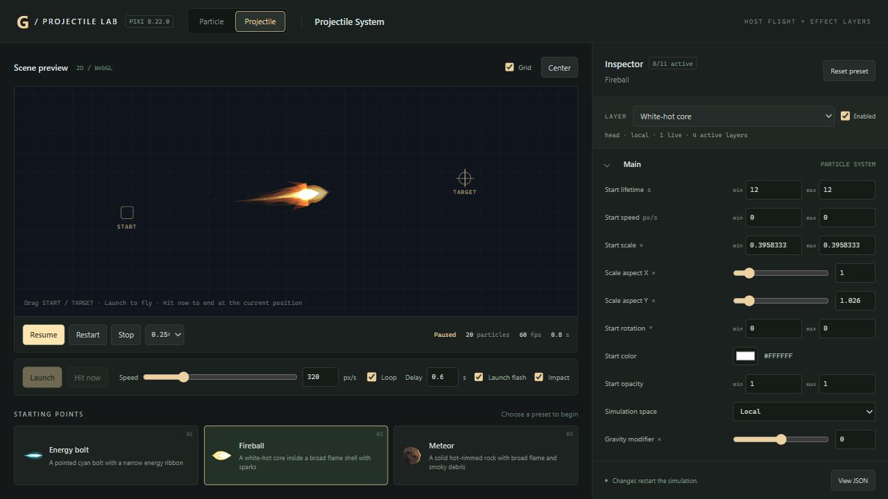
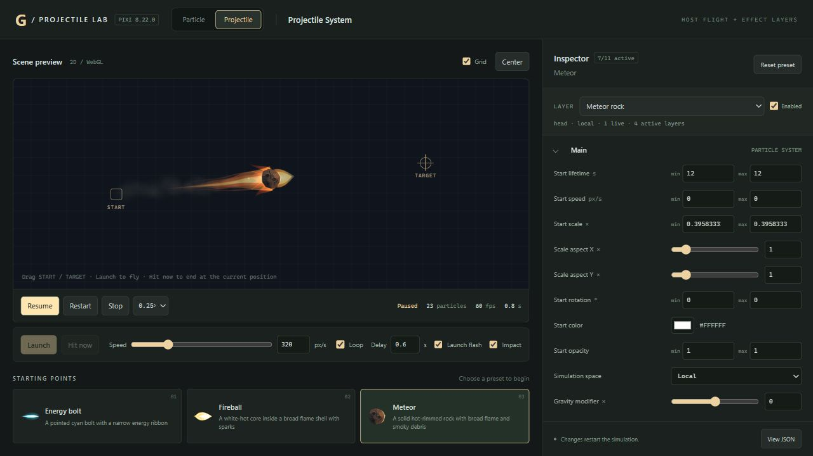

# pixi8-particle-system

Geminant is a modular 2D effects runtime built for PixiJS 8's `ParticleContainer`. It adds emission, motion, gravity, lifetime and playback control to Pixi's particle rendering.

## Features

- Continuous emission, timed bursts, delayed starts, finite effects and looping.
- Per-particle lifetime and appearance ranges, gravity, force and drag.
- Local/world simulation, trails, animated frames and layered effects.
- Coordinated playback and draining, including projectile heads that end on impact while smoke and retained trails finish.

Particle and Projectile effects share one runtime and JSON configuration contract. Particle covers fixed/local effects and standalone launch flashes or impacts. Projectile covers flying bodies, effects following a moving source and two-end connections. The host supplies movement, hit events and endpoint adaptation.

## Particle & Projectile Labs

Two workspaces with editable modules, playback controls and JSON export:

### Particle Lab

Embers, water fountain, soft smoke and dust/debris, with emitter dragging and manual bursts.



### Projectile Lab

Energy bolt, fireball and meteor, with directional textures, layered heads/trails, movable endpoints and launch/hit controls.

| Energy bolt | Fireball | Meteor |
| --- | --- | --- |
|  |  |  |

## Build and run

Build the runtime first:

```sh
cd geminum-particles
npm install
npm run build
npm test
```

Then start the example:

```sh
cd ../example
npm install
npm run dev
```

For static hosting, run `npm run build` in `example/` and deploy `example/dist/`. See [example controls and setup](example/README.md).

The package name is `geminant-particles`, with `/core`, `/config` and `/pixi` entry points for simulation, JSON configuration and Pixi rendering.

## Agent skills

- [Particle creation](.agents/skills/skill-geminum-particle/SKILL.md): design fixed/local effects, select textures and generate configuration.
- [Projectile creation](.agents/skills/skill-geminum-projectile/SKILL.md): design moving/connecting effects and plan host movement and impact handoff.
- [Runtime development](.agents/skills/skill-pixi-geminant-particles/SKILL.md): integrate, extend and diagnose the SDK.

Both creator skills use the [shared JSON Schema](.agents/skills/skill-geminum-particle/references/effect.schema.json) and [configuration semantics](.agents/skills/skill-geminum-particle/references/effect-contract.md). Distribute the three skill folders together to preserve their links.
